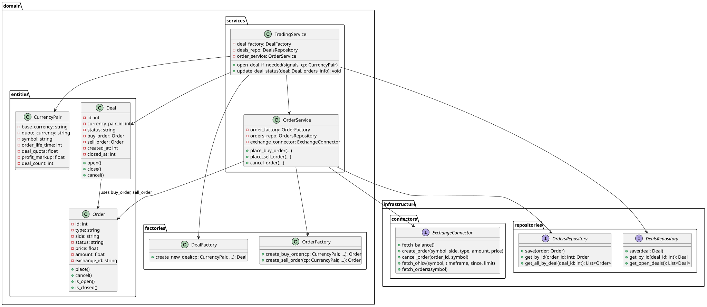

# 🚀 AutoTrade v2.4.1-dev - "Database Migration & Performance Optimization"

> **Интеллектуальная торговая система** с революционной двухуровневой архитектурой хранения  
> **Архитектура**: Предметно-ориентированное проектирование (DDD) + PostgreSQL Integration  
> **Статус**: Готов к работе с персистентным хранением

[](https://github.com/sni10/new_autotrade/actions)
[](https://github.com/sni10/new_autotrade/actions)
[](https://www.python.org/)



---

## 📋 Содержание
- [🎯 Обзор](#-обзор)
- [📖 Документация](#-документация)
- [✨ Ключевые возможности](#-ключевые-возможности)
- [���️ Архитектура](#️-архитектура)
- [🚀 Быстрый старт](#-быстрый-старт)
- [📊 Производительность](#-производительность)
- [🔧 Конфигурация](#-конфигурация)
- [📈 Торговый процесс](#-торговый-процесс)
- [🛡️ Системы безопасности](#️-системы-безопасности)
- [📋 План развития](#-план-развития)
- [🎯 Обзор задач](#-обзор-задач)
- [🌿 Стратегия ветвления](#-стратегия-ветвления)
- [🚀 Развертывание](#-развертывание)
- [💎 Заключение](#-заключение)

---

## 🎯 Обзор

**AutoTrade** - профессиональная система для автоматической торговли криптовалютами с интеллектуальным анализом биржевого стакана и техническими индикаторами. Система построена на принципах предметно-ориентированного проектирования (DDD) и использует асинхронную архитектуру для максимальной производительности.

### 🔥 Последний релиз: v2.4.1-dev - "Database Migration & Performance Optimization"
- 🚀 **Революционная двухуровневая архитектура** - RAM (наносекунды) + PostgreSQL (надежность).
- 🏗️ **MemoryFirst репозитории** - `MemoryFirstDealsRepository`, `MemoryFirstOrdersRepository` с фоновой синхронизацией.
- 🛡️ **Автоматическое восстановление состояния** после перезапуска системы.
- 🔧 **RepositoryFactory с fallback** - система работает даже при недоступности PostgreSQL.
- ✅ **Критические исправления** - PostgreSQL constraint violation и asyncio event loop проблемы.

---

## 📖 Документация

### 📚 **Полное руководство**
- [📖 Центр документации](docs/README.md) - Главная страница документации

### 🚀 **Быстрый старт**
- [📦 Установка и настройка](docs/getting-started/INSTALLATION.md)
- [⚙️ Конфигурация системы](docs/getting-started/CONFIGURATION.md)
- [🏃 Быстрый запуск](docs/getting-started/QUICK_START.md)

### 🛠️ **Практические руководства**
- [📊 Инте��рация анализа стакана](docs/guides/ORDERBOOK_INTEGRATION.md)
- [🔍 Мониторинг BUY ордеров](docs/guides/BUY_ORDER_MONITOR.md)

### 🏗️ **Архитектура и разработка**
- [🏗️ Архитектура проекта](docs/architecture/PROJECT_OVERVIEW.md)
- [📋 Обзор модулей](docs/architecture/MODULE_OVERVIEW.md)
- [📂 Структура файлов](docs/architecture/FILE_STRUCTURE.md)

### 🔧 **API и интеграция**
- [🔧 Справочник API](docs/api/API_REFERENCE.md)
- [🏪 Интеграция с биржами](docs/api/EXCHANGE_INTEGRATION.md)

### 📋 **Разработка**
- [📋 Руководства по реализации](docs/development/IMPLEMENTATION_GUIDES.md)
- [📊 Управление проектом](docs/development/project_management/)

### 📦 **Релизы**
- [📝 История изменений](docs/releases/CHANGELOG.md)
- [🗺️ Дорожная карта](docs/releases/ROADMAP.md)
- [📦 Заметки о релизах](docs/releases/release-notes/)

### 🛠️ **Помощь**
- [🔧 Устранение неполадок](docs/troubleshooting/TROUBLESHOOTING.md)
- [❓ Часто задаваемые вопросы](docs/troubleshooting/FAQ.md)

### ���️ **Технические спецификации**
**Язык**: Python 3.10
**Основные зависимости**: `requirements.txt`

- **Архитектура**: Clean Architecture / DDD
- **Конкурентность**: на базе asyncio

### 🔗 **Полезные ссылки**
- **Биржа**: Binance API
- **Технический анализ**: TA-Lib
- **WebSocket**: ccxt.pro
- **Синхронизация времени**: Binance Time API

## 🌿 Стратегия ветвления
AutoTrade теперь следует рабочему процессу **GitFlow**:
- `main` – готовый к продакшену код
- `stage` – предпродакшн тестирование
- `dev` – интеграционная ветка для новых фич
- `feature/*` – новая функциональность на основе `dev`
- `release/*` – подготовка релиза на основе `stage`
- `hotfix/*` – срочные исправления на основе `main`

```
feature/*   -> dev
dev         -> stage
stage       -> release/*
release/*   -> main + dev
hotfix/*    -> main + dev
```

### 🔖 Версионирование
Релизы создаются автоматически при п��ше в `main`. Рабочий процесс анализирует коммиты
и увеличивает **мажорную**, **минорную** или **патч** версию соответственно, тегируя репозиторий
`vX.Y.Z` и генерируя заметки о релизе.

---

## ✨ Ключевые возможности

### 🧠 Интеллектуальная торговля
- **Технический анализ `MACD`** с анализом гистограммы
- **Анализ биржевого стакана (`OrderBook Intelligence`)** - спред, ликвидность, поддержка/сопротивление
- **Умные модификации ордеров (`Smart Order Modifications`)** - корректировка цен на основе технических уровней  
- **Оценка уверенности сигнала (`Signal Confidence Scoring`)** - система скоринга сигналов

### ⚡ Производительность и надежность
- **Асинхронная архитектура** на базе `asyncio` для максимальной скорости
- **Интеграция `WebSocket`** через `ccxt.pro` для real-time данных
- **Мониторинг производительности (`Performance Monitoring`)** с детальными метриками
- **Сохранение состояния (`JSON-based Persistence`)** на основе JSON.

### 🛡️ Системы безопасности  
- **`Smart StopLossMonitor`** - трёхуровневая защита от убытков с анализом стакана.
- **`SignalCooldownManager`** - защита от переторговки.
- **`Enhanced BuyOrderMonitor`** - синхронизация виртуальных `SELL` ордеров при пересоздании.
- **Валидация по стакану (`OrderBook Validation`)** - отклонение сделок при плохой ликвидности.
- **Конфигурация через окружение (`Environment-based`)** с помощью `.env` файлов.

### 📊 Аналитика и мониторинг
- **`MarketAnalysisService`** - анализ волатильности и трендов
- **Логирование производительности (`Real-time Performance Logging`)** в реальном времени 
- **Торговые рекомендации (`Trading Recommendations`)** на основе рыночных условий
- **Мониторинг состояния стакана (`OrderBook Health Monitoring`)**

---

## 🏗️ Архитектура

### 📐 Структура на основе Domain-Driven Design (Реальная структура проекта)

```
new_autotrade/
├── src/                       # 🎯 Основной исходный код
│   ├── domain/                # 🧠 Бизнес-логика
│   │   ├── entities/          # Ключевые бизнес-сущности
│   │   │   ├── deal.py       # Торговые сделки
│   │   │   ├── order.py      # Биржевые ордера  
│   │   │   ├── currency_pair.py # Торговые пары
│   │   │   └── ticker.py     # Рыночные тикеры
│   │   ├── factories/         # Создание объектов
│   │   │   ├── deal_factory.py
│   │   │   └── order_factory.py
│   │   └── services/          # Бизнес-сервисы
│   │       ├── deals/
│   │       │   ├── deal_service.py           # Управление сделками
│   │       │   └── deal_completion_monitor.py # 🆕 Завершение сделок
│   │       ├── orders/
│   │       │   ├── order_service.py          # Уп��авление ордерами
│   │       │   ├── order_execution_service.py # Исполнение ордеров
│   │       │   ├── buy_order_monitor.py      # 🔄 Улучшенный мониторинг
│   │       │   └── filled_buy_order_handler.py # 🆕 Обработчик BUY ордеров
│   │       ├── market_data/
│   │       │   ├── ticker_service.py         # Рыночные данные
│   │       │   ├── orderbook_analyzer.py     # Анализ стакана
│   │       │   ├── orderbook_service.py      # Мониторинг стакана
│   │       │   └── market_analysis_service.py # Анализ рынка
│   │       ├── trading/
│   │       │   ├── trading_service.py        # Основная логика торговли
│   │       │   ├── trading_decision_engine.py # Механизм принятия решений
│   │       │   └── signal_cooldown_manager.py # Система защиты
│   │       ├── risk/
│   │       │   └── stop_loss_monitor.py      # 🆕 Умный стоп-лосс
│   │       ├── indicators/
│   │       │   └── cached_indicator_service.py # Оптимизаци�� производительности
│   │       └── utils/
│   │           ├── decimal_rounding_service.py # 🆕 Точное округление
│   │           └── orderbook_cache.py         # 🆕 Кеширование стакана
│   │
│   ├── application/           # 🚀 Сценарии использования  
│   │   ├── use_cases/
│   │   │   └── run_realtime_trading.py # Торговля в реальном времени
│   │   └── utils/
│   │       └── performance_logger.py   # Логирование производительности
│   │
│   ├── infrastructure/        # 🔌 Внешние интеграции
│   │   ├── repositories/      # Хранение данных (на основе JSON)
│   │   │   ├── deals_repository.py
│   │   │   ├── orders_repository.py
│   │   │   └── tickers_repository.py
│   │   └── connectors/        # Внешние сервисы
│   │       └── exchange_connector.py   # API биржи
│   │
│   └── config/
│       ├── config.json        # Основная конфигурация
│       └── config_loader.py   # Загрузчик конфигурации
│
├── binance_keys/              # 🔐 Хранилище API ключей
├── project_management/        # Документация и задачи
├── tests/                     # 🧪 Наборы тестов
├── .env.example              # Шаблон переменных окружения
├── main.py                   # 🎯 Точка входа в приложение
└── *.md                      # Документация
```

### 🎨 Схема архитектуры

[schema-app.puml](schema-app.puml)

<details>
  <summary>📐 Схема Plant UML</summary>

```
@startuml
namespace domain.entities {
  class Deal {
    - id: int
    - currency_pair_id: int
    - status: string
    - buy_order: Order
    - sell_order: Order
    - created_at: int
    - closed_at: int
    + open()
    + close()
    + cancel()
  }

  class Order {
    - id: int
    - type: string
    - side: string
    - status: string
    - price: float
    - amount: float
    - exchange_id: string
    + place()
    + cancel()
    + is_open()
    + is_closed()
  }

  class CurrencyPair {
    - base_currency: string
    - quote_currency: string
    - symbol: string
    - order_life_time: int
    - deal_quota: float
    - profit_markup: float
    - deal_count: int
  }

  class Ticker {
    - symbol: string
    - price: float
    - timestamp: int
    - volume: float
    - signals: Dict
    + update_signals()
  }
}

namespace domain.factories {
  class DealFactory {
    + create_new_deal(cp: CurrencyPair, ...): Deal
  }

  class OrderFactory {
    + create_buy_order(cp: CurrencyPair, ...): Order
    + create_sell_order(cp: CurrencyPair, ...): Order
  }
}

namespace domain.services {
  class TradingService {
    - deal_factory: DealFactory
    - deals_repo: DealsRepository
    - order_service: OrderService
    + open_deal_if_needed(signals, cp: CurrencyPair)
    + update_deal_status(deal: Deal, orders_info): void
  }

  class OrderService {
    - order_factory: OrderFactory
    - orders_repo: OrdersRepository
    - exchange_connector: ExchangeConnector
    + place_buy_order(...)
    + place_sell_order(...)
    + cancel_order(...)
  }

  class OrderBookAnalyzer {
    + analyze_spread()
    + analyze_liquidity()
    + find_support_resistance()
    + calculate_slippage()
    + generate_signal()
  }

  class TradingDecisionEngine {
    + combine_signals()
    + generate_modifications()
    + calculate_confidence()
  }
}

namespace infrastructure.connectors {
  interface ExchangeConnector {
    + fetch_balance()
    + create_order(symbol, side, type, amount, price)
    + cancel_order(order_id, symbol)
    + fetch_ohlcv(symbol, timeframe, since, limit)
    + fetch_orders(symbol)
  }

  class ProExchangeConnector {
    + watch_ticker()
    + watch_orderbook()
    + create_order_async()
  }
}

namespace infrastructure.repositories {
  interface DealsRepository {
    + save(deal: Deal)
    + get_by_id(deal_id: int): Deal
    + get_open_deals(): List<Deal>
  }

  interface OrdersRepository {
    + save(order: Order)
    + get_by_id(order_id: int): Order
    + get_all_by_deal(deal_id: int): List<Order>
  }

  interface TickersRepository {
    + save(ticker: Ticker)
    + get_latest(): Ticker
    + get_history(): List<Ticker>
  }
}

@enduml
```

</details>

---

## 🚀 Быстрый старт

### 📦 Установка

```bash
# Клонировать репозиторий
git clone <repository-url>
cd new_autotrade

# Установить зависимости
pip install -r requirements.txt

# Настроить API ключи
# Создайте `.env` из `.env.example` и добавьте ваши API ключи
```

### ⚙️ Конфигурация

Конфигурация загружается из `config/config.json` и может быть переопределена созданием файла `.env` в корне проекта. Смотрите `.env.example` для необходимых переменны��.

### 🎯 Запуск торговли

```bash
# Запустить торговую систему
python main.py
```

---

## 📊 Производительность

### 📈 **Метрики в реальном времени**
- **Обработка тика**: < 1ms в нормальных условиях
- **Задержка WebSocket**: минимальная задержка данных  
- **Эффективность памяти**: оптимизированное хранение истории
- **Оптимизация CPU**: эффективные вычисления индикаторов

### 🎯 **Торговая статистика**
- **Точность сигнала**: улучшена благодаря анализу стакана
- **Контроль проскальзывания**: автоматическая валидация ликвидности
- **Управление рисками**: многоуровневая система защиты

### 📊 **Компоненты системы**
- **~500+ строк** основного торгового кода
- **11+ доменных сервисов** для разных аспектов торговли
- **4 типа анализа**: MACD, волатильность, тренды, стак��н
- **3 уровня защиты**: "остывание", лимиты, валидация ликвидности

---

## 🔧 Конфигурация

### 🎛️ **Настройки анализа стакана**

| Параметр | Описание | По умолчанию |
|-----------|-------------|---------|
| `min_volume_threshold` | Минимальный объем для анализа | 1000 |
| `big_wall_threshold` | Порог для определения "стенки" | 5000 |
| `max_spread_percent` | Максимально допустимый спред | 0.3% |
| `min_liquidity_depth` | Минимальная глубина ликвидности | 15 |
| `typical_order_size` | Типичный размер ордера | 10 USDT |
| `monitoring_interval` | Интервал мониторинга | 0.1 сек |

### 🛡️ **Настройки защиты**

| Параметр | Описание | По умолчанию |
|-----------|-------------|---------|
| `enable_orderbook_validation` | Включить валидацию по стакану | true |
| `orderbook_confidence_threshold` | Порог уверенности | 0.6 |
| `require_orderbook_support` | Требовать поддержку от стакана | false |
| `log_orderbook_analysis` | Л��гировать анализ стакана | true |

---

## 📈 Торговый процесс

Система работает по асинхронной, событийно-ориентированной модели, что делает ее надежной и быстрой. Жизненный цикл сделки разделен на несколько независимых этапов, управляемых разными сервисами.

### 🔄 **Асинхронный жизненный цикл сделки (v2.4.0)**

**Революционное изменение**: Отказ от одновременного размещения `BUY` и `SELL` ордеров в пользу поэтапного исполнения.

1.  **Сигнал и Валидация**:
    -   `TickerService` анализирует график и генерирует первичный сигнал `BUY` по индикатору MACD.
    -   `OrderBookAnalyzer` немедленно проверяет сигнал по стакану. Если ликвидность низкая или дисбаланс объемов негативный, сигнал отклоняется.

2.  **Инициация Сделки**:
    -   Если сигнал подтвержден, `OrderExecutionService` с��здает `Deal` (сделку).
    -   На биржу отправляется **только `BUY` ордер**.
    -   `SELL` ордер создается "виртуально" (в памяти, со статусом `PENDING`) и ждет своего часа.

3.  **Мониторинг и Адаптация (параллельные процессы)**:
    -   **`BuyOrderMonitor`**: Если `BUY` ордер "застрял" (цена ушла), этот сервис отменит его, создаст новый по актуальной цене и, что важно, **обновит** параметры "виртуального" `SELL` ордера в локальной памяти.
    -   **`FilledBuyOrderHandler`** (🆕): Как только `BUY` ордер исполняется, этот сервис "замечает" это и **отправляет на биржу** связанный с ним `SELL` ордер.

4.  **Завершение Сделки**:
    -   **`DealCompletionMonitor`** (🆕): Этот сервис отслеживает общее состояние сделок. Когда и `BUY`, и `SELL` ордера исполнены (`FILLED`), он закрывает сделку, меняя ее статус на `CLOSED`.

5.  **Защита от потерь**:
    -   **`StopLossMonitor`** (🆕): Трёхуровневая система защиты с анализом стакана перед принятием решений о закрытии убыточных позиций.

Эта архитектура гарантирует, что система не "забывает" про сделки и гибко адаптируется к рыночным изменениям, при этом обеспечивая максимальную безопасность.

### ✅ **Пример успешного сигнала**
```
🟢🔥 MACD СИГНАЛ ПОКУПКИ → 📊 АНАЛИЗ СТАКАНА: OK → 🚀 OrderExecutionService:
   - Создана сделка #123
   - На биржу отправлен BUY ордер #BUY-A
   - В памяти создан PENDING SELL ордер #SELL-A
```

### ❌ **Пример отклоненного сигнала**
```
🟢🔥 MACD СИГНАЛ ПОКУПКИ → 📊 АНАЛИЗ СТАКАНА: ОТКЛОНЕНО (слабый спрос) → 🚫 Сделка отменена
```

---

## 🛡️ Системы безопасности

### 🔒 **Механизмы защиты**
- **`SignalCooldownManager`** - предотвращение переторговки.
- **Лимит�� позиций** - ограничение количества активных сделок.
- **Валидация по стакану** - проверка качества стакана.
- **Мониторинг "тухлых" ордеров** - отмена "застрявших" ордеров для предотвращения потерь.

### ⚠️ **Управление рисками**
- **Мониторинг "тухлых" ордеров** - отмена "застрявших" ордеров по времени и отклонению цены.
- **Экстренное отключение** - возможность экстренно остановить всю торговлю и отменить ордера.
- **Проверка отклонения цены** - часть мониторинга "протухших" ордеров.
- **Размер позиции** - адаптивный размер позиций.
- **Анализ рынка** - анализ рыночных условий.

### 🔐 **Функции безопасности**
- **Раздельные API ключи** для песочницы и продакшена.
- **Конфигурация через окружение** - безопасное управление ключами через перемен��ые окружения.
- **Хранение приватных ключей** в отдельной папке `binance_keys/`.

---

## 📋 План развития

### ✅ **Фаза 1 и 2: Основа и ядро логики (Завершено)**
- [x] **Асинхронная архитектура**
- [x] **Безопасная конфигурация** (через .env)
- [x] **Реализация торговой логики** (размещение ордеров)
- [x] **Управление рисками** (мониторинг ордеров, "остывание")
- [x] **Сохранение данных** (через JSON)

### 🚀 **Фаза 3: Готовность к продакшену (Следующие шаги)**
- [ ] **Продвинутая обработка ошибок** (переподключение, повторные попытки)
- [ ] **Мониторинг и оповещения** (проверки состояния, Telegram)
- [ ] **Комплексное тестирование** (модульное, интеграционное, бэктесты)
- [ ] **Управление состоянием** (восстановление состояния при перезапуске)

### ✨ **Фаза 4: Продвинутые возможности (��удущее)**
- [ ] **Торговля несколькими парами**
- [ ] **ML-прогнозирование**
- [ ] **REST API** для управления ботом

---

## 🎯 Обзор задач


### 🔥 **Критические задачи** (Обязательно для v3.0.0)

🏗️ **M1** | ✅ **ЗАВЕРШЕНО** - [Issue #20](https://github.com/sni10/new_autotrade/issues/20) - Главный дирижер - разделить монолитную логику `run_realtime_trading.py` на управляемые компоненты

🏗️ **M1** | ✅ **ЗАВЕРШЕНО** - [Issue #19](https://github.com/sni10/new_autotrade/issues/19) - Реальное выставление ордеров - бот фактически торгует и зарабатывает деньги

🏗️ **M2** | ✅ **ЗАВЕРШЕНО** - [Issue #6](https://github.com/sni10/new_autotrade/issues/6) - Система хранения данных - данные не теряются при перезапуске

### ⚡ **Высокоприоритетные задачи** (Важно для стабильности)

🏗️ **M1** | ✅ **ЗАВЕРШЕНО** - [Issue #18](https://github.com/sni10/new_autotrade/issues/18) - Управление рисками - защита от потери средств через stop-loss и лимиты

🏗️ **M2** | [ ] [Issue #16](https://github.com/sni10/new_autotrade/issues/16) - Управление состоянием - "грациозный" перезапуск без потери контекста

🏗️ **M2** | ✅ **ЗАВЕРШЕНО** - [Issue #15](https://github.com/sni10/new_autotrade/issues/15) - Управление конфигурацией - соответствие стандартам безопасности и удобство настройки

🏗️ **M3** | [ ] [Issue #14](https://github.com/sni10/new_autotrade/issues/14) - Обработка ошибок - устойчивость к сбоям и автовосстановление

🏗️ **M3** | [ ] [Issue #13](https://github.com/sni10/new_autotrade/issues/13) - Безопасность - шифрование чувствительных данных и защита от атак

### 📈 **Среднеприоритетные задачи** (Желательные улучшения)

🏗️ **M1** | ✅ **ЗАВЕРШЕНО** - [Issue #8](https://github.com/sni10/new_autotrade/issues/8) - Улучшенный анализ рынка - лучшие торговые решения

🏗️ **M1** | ✅ **ЗАВЕРШЕНО** - [Issue #7](https://github.com/sni10/new_autotrade/issues/7) - Агрегация сигналов - меньше ложных сигналов

🏗️ **M3** | [ ] [Issue #21](https://github.com/sni10/new_autotrade/issues/21) - Мониторинг системы - проактивное об��аружение проблем

🏗️ **M4** | [ ] [Issue #12](https://github.com/sni10/new_autotrade/issues/12) - Оптимизация производительности - < 1ms обработка тика в 95% случаев

### 🎯 **Низкоприоритетные задачи** (Будущие возможности)

🏗️ **M2** | ✅ **ЗАВЕРШЕНО** - [Issue #6](https://github.com/sni10/new_autotrade/issues/6) - Улучшенные репозитории - быстрые операции с данными

🏗️ **M3** | [ ] [Issue #5](https://github.com/sni10/new_autotrade/issues/5) - Резервное копирование - защита от потери данных

🏗️ **M4** | [ ] [Issue #11](https://github.com/sni10/new_autotrade/issues/11) - Мультивалютная торговля - масштабирование на множественные активы


---

## 🚀 Развертывание

### 📦 **Реальная структура файлов**
```
new_autotrade/
├── main.py              # Начать здесь
├── config/config.json   # Основная конфигурация
├── .env.example         # Переопределения окружения
├── binance_keys/        # Ваши API кл��чи здесь
├── domain/              # Основная бизнес-логика
├── application/         # Сценарии использования и утилиты
├── infrastructure/      # Внешние интеграции
├── project_management/  # Документация и задачи
└── *.md                # Документация
```

### 🎯 **Начало работы**
1. **Настройте API ключи** в `binance_keys/`
2. **Создайте `.env`** на основе `.env.example` для переопределения настроек
3. **Запустите** `python main.py`
4. **Отслеживайте** логи для мониторинга торговой активности

---

## 💎 Заключение

**AutoTrade v2.3.0** представляет собой профессиональную торговую систему с интеллектуальным анализом рынка. Интеграция анализа биржевого ��такана в сочетании с индикаторами MACD создает мощный инструмент для автоматической торговли.

**Ключевые преимущества:**
- ✅ **��мные решения** на основе анал��за ликвидности
- ✅ **Высокая производительность** благодаря асинхронной архитектуре  
- ✅ **Надежная защита** от переторговки и плохих сигналов
- ✅ **Гибкая конфигурация** под разные торговые стратегии

> *"Торгуйте умнее, а не больше"* 🎯

---

**Разработчик**: Dmitry Strelets (sni10)  
**Репозиторий**: `velostour/new_autotrade`  
**Лицензия**: Private