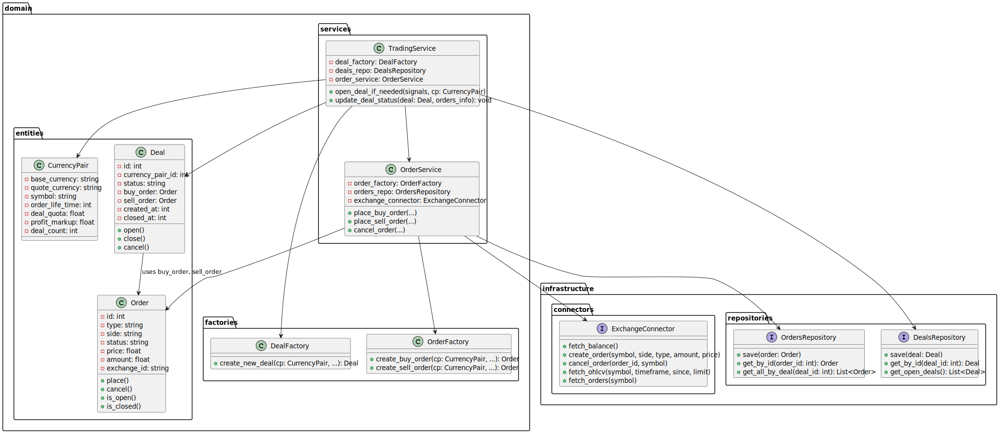

[schema-app.puml](schema-app.puml)




```
my_trading_app/
│
├── domain/
│   ├── entities/
│   │   ├── deal.py
│   │   ├── order.py
│   │   ├── currency_pair.py
│   │   ├── exchange_settings.py
│   │   ...
│   ├── factories/
│   │   ├── deal_factory.py
│   │   ├── order_factory.py
│   │   └── ...
│   ├── services/
│   │   ├── trading_service.py
│   │   ├── order_service.py
│   │   ├── signal_service.py     # опционально
│   │   └── ...
│   ├── events/
│   │   └── deal_opened_event.py
│   │   ...
│   └── __init__.py
│
├── application/
│   ├── use_cases/
│   │   ├── run_trading.py        # классический сценарий торговли
│   │   ├── run_realtime_trading.py
│   │   ├── handle_signals.py
│   │   └── ...
│   ├── trading_loop.py           # асинхронный цикл, вызывающий use-cases
│   └── __init__.py
│
├── infrastructure/
│   ├── repositories/
│   │   ├── deals_repository.py
│   │   ├── orders_repository.py
│   │   ├── currency_pairs_repository.py
│   │   └── __init__.py
│   ├── connectors/
│   │   ├── exchange_connector.py
│   │   ├── market_data_connector.py
│   │   ├── db_connector.py
│   │   └── __init__.py
│   └── config/
│       ├── settings.py
│       └── __init__.py
│
├── interfaces/
│   ├── cli/
│   │   ├── main_cli.py
│   │   └── ...
│   ├── # потенциально REST API
│   └── __init__.py
│
├── utils/
│   ├── utils.py
│   └── __init__.py
│
├── tests/
│   └── ...
│
└── main.py

```

<details>
  <summary>SCHEMA PLANT UML</summary>

```@startuml
namespace domain.entities {
  class Deal {
    - id: int
    - currency_pair_id: int
    - status: string
    - buy_order: Order
    - sell_order: Order
    - created_at: int
    - closed_at: int
    + open()
    + close()
    + cancel()
  }

  class Order {
    - id: int
    - type: string
    - side: string
    - status: string
    - price: float
    - amount: float
    - exchange_id: string
    + place()
    + cancel()
    + is_open()
    + is_closed()
  }

  class CurrencyPair {
    - base_currency: string
    - quote_currency: string
    - symbol: string
    - order_life_time: int
    - deal_quota: float
    - profit_markup: float
    - deal_count: int
  }
}

namespace domain.factories {
  class DealFactory {
    + create_new_deal(cp: CurrencyPair, ...): Deal
  }

  class OrderFactory {
    + create_buy_order(cp: CurrencyPair, ...): Order
    + create_sell_order(cp: CurrencyPair, ...): Order
  }
}

namespace domain.services {
  class TradingService {
    - deal_factory: DealFactory
    - deals_repo: DealsRepository
    - order_service: OrderService
    + open_deal_if_needed(signals, cp: CurrencyPair)
    + update_deal_status(deal: Deal, orders_info): void
  }

  class OrderService {
    - order_factory: OrderFactory
    - orders_repo: OrdersRepository
    - exchange_connector: ExchangeConnector
    + place_buy_order(...)
    + place_sell_order(...)
    + cancel_order(...)
  }
}

namespace infrastructure.connectors {
  interface ExchangeConnector {
    + fetch_balance()
    + create_order(symbol, side, type, amount, price)
    + cancel_order(order_id, symbol)
    + fetch_ohlcv(symbol, timeframe, since, limit)
    + fetch_orders(symbol)
  }
}

namespace infrastructure.repositories {
  interface DealsRepository {
    + save(deal: Deal)
    + get_by_id(deal_id: int): Deal
    + get_open_deals(): List<Deal>
  }

  interface OrdersRepository {
    + save(order: Order)
    + get_by_id(order_id: int): Order
    + get_all_by_deal(deal_id: int): List<Order>
  }
}

domain.entities.Deal --> domain.entities.Order : uses buy_order, sell_order

domain.services.TradingService --> domain.entities.Deal
domain.services.TradingService --> domain.entities.CurrencyPair
domain.services.TradingService --> domain.factories.DealFactory
domain.services.TradingService --> infrastructure.repositories.DealsRepository
domain.services.TradingService --> domain.services.OrderService

domain.services.OrderService --> domain.entities.Order
domain.services.OrderService --> domain.factories.OrderFactory
domain.services.OrderService --> infrastructure.connectors.ExchangeConnector
domain.services.OrderService --> infrastructure.repositories.OrdersRepository

@enduml
```

</details>

Ниже приведён **примерный план** реализации приложения в несколько этапов, с учётом той архитектуры, которую мы обсуждали. Каждый этап включает короткое описание шагов и их приоритет. При этом, разумеется, вы можете адаптировать и менять приоритеты исходя из своих текущих потребностей.

---

## Этап 1: Базовая доменная модель

**Цель**: Создать фундаментальные классы сущностей (Entities), фабрик (Factories) и репозиториев (Repositories) с минимумом бизнес-логики.

1. **Создать доменные сущности** (в папке `domain/entities/`):  
   - `Deal` (сделка)  
   - `Order` (ордер)  
   - `CurrencyPair` (пара)  
   - (Возможно) `ExchangeSettings` для хранения базовых настроек биржи.  

   \> **Результат**: имеются классы с необходимыми полями и простыми методами (например, `deal.open()`, `deal.close()`, `order.is_open()` и т.д.).

2. **Добавить фабрики** (в папке `domain/factories/`):  
   - `DealFactory` — метод `create_new_deal(...)`, который сразу создаёт сделку с buy/sell ордерами (или хотя бы заготовками).  
   - `OrderFactory` — методы `create_buy_order(...)`, `create_sell_order(...)`, чтобы логика инициализации ордеров была в одном месте.  

   \> **Результат**: единая точка входа для создания сделок и ордеров.

3. **Определить интерфейсы репозиториев** (в папке `infrastructure/repositories/`):  
   - `DealsRepository`: методы `save(deal)`, `get_by_id(deal_id)`, `get_open_deals()`, и т.д.  
   - `OrdersRepository`: методы `save(order)`, `get_by_id(order_id)`, `get_all_by_deal(deal_id)`, и т.д.  

   \> **Результат**: контракт (interface/абстрактный класс) для работы с данными без привязки к конкретной БД.

4. **Создать «пустые» реализации репозиториев**  
   - Например, `InMemoryDealsRepository`, `InMemoryOrdersRepository` (внутри той же папки `infrastructure/repositories/`), которые пока **просто** хранят объекты в обычных структурах Python (dict/list).  

   \> **Результат**: можно уже вызывать `.save()` и `.get_by_id()` без реальной БД — но архитектура готова к расширению.

---

## Этап 2: Бизнес-логика (Domain Services) и базовый Use-case

**Цель**: Реализовать высокоуровневую логику открытия/закрытия сделок, научиться orchestration (Use-case).

1. **Создать сервисы** (в папке `domain/services/`):  
   - `TradingService` (решения о сделках), методы:  
     - `open_deal_if_needed(...)`, принимающий сигналы/условия, создающий сделку через `DealFactory`, сохраняющий её в `DealsRepository`, и т.д.  
     - `update_deal_status(...)`, если нужно проверять исполнение ордеров.  
   - `OrderService` (выставление ордеров), методы:  
     - `place_buy_order(...)`, `cancel_order(...)`, и т.д. (пока только «заглушки»).  

2. **Use-case** (в папке `application/use_cases/`):  
   - Например, `run_trading.py`, который:  
     1. Инициализирует репозитории (InMemory- или Mock-реализации).  
     2. Создаёт `TradingService`, `OrderService` и `DealFactory`.  
     3. Вызывает `open_deal_if_needed(...)`, чтобы протестировать базовый сценарий (получили сигнал — открыли сделку).  
   - Это поможет проверить «сквозной» цикл работы: создание сделки → сохранение → вывод в консоль «Сделка открыта» и т.п.

3. **Минимальные тесты**:  
   - В папке `tests/` написать пару unit-тестов: проверить, что `TradingService` корректно создаёт сделку и вызывает `DealsRepository.save()`.

---

## Этап 3: Инфраструктура — Коннекторы для биржи

**Цель**: Обеспечить реальное взаимодействие с биржей (REST или WebSocket).

1. **ExchangeConnector** (в `infrastructure/connectors/exchange_connector.py`):  
   - Интерфейс (или абстрактный класс) с методами:  
     - `create_order(symbol, side, type, amount, price=...)`  
     - `cancel_order(order_id, symbol)`  
     - `fetch_balance()`  
     - `fetch_ohlcv(symbol, timeframe, since, limit)`  
     - и т.д.  
   - С помощью ccxt/ccxt.pro или nативных API. Сначала можно реализовать «заглушку» (mock) для тестов.

2. **OrderService** доработать**:  
   - Теперь при `place_buy_order(...)` вызываем реальный `ExchangeConnector.create_order(...)`.  
   - Сохраняем ответ биржи (orderId) в доменном объекте `Order` (e_id).  
   - `OrdersRepository.save(order)`.

3. **MarketDataConnector** (при работе с WebSocket / ccxt.pro / binance websocket API):  
   - Метод `subscribe_ticker(symbol)`, метод `on_message(callback)`.  
   - Поднимаем асинхронное подключение.  
   - При поступлении нового сообщения (цена/объём) вызываем callback, передавая обновлённые данные.

4. **Use-case** `run_realtime_trading.py`:  
   - Асинхронно инициализирует `MarketDataConnector`.  
   - Подписывается на события: `connector.on_message(self.handle_new_tick)`.  
   - В `handle_new_tick` вызывает `TradingService.open_deal_if_needed(...)` или `TradingService.update_deal_status(...)`.

---

## Этап 4: Сигналы и индикаторы (SignalService, utils)

**Цель**: Научиться рассчитывать RSI, MACD и прочие маркеры, а затем реагировать на них.

1. **SignalService** (доменный сервис или application service):  
   - Метод `calculate_indicators(candle_data)`, возвращает структуру вида `{'rsi': 25, 'macd': 0.001, ...}`.  
   - Метод `generate_signal(indicators)`, возвращает ‘BULLISH’, ‘BEARISH’ и т.д.  

2. **Use-case** `run_trading.py` / `run_realtime_trading.py`:  
   - Перед тем, как вызвать `open_deal_if_needed()`, вызывает `signal_service.calculate_indicators(...)`.  
   - На основании результата решает «надо ли покупать».  

3. **Сохранение истории** (если нужно) в том же репозитории (или в отдельном `MarketDataRepository`), чтобы потом было из чего рассчитывать индикаторы (например, храним последние 500 1m-свечей).

---

## Этап 5: Оптимизация хранения (Repositories и БД)

**Цель**: Подключить реальную БД (Redis / SQLite / PostgreSQL и т.д.), чтобы было надёжно и быстро.

1. **DBConnector** (в `infrastructure/connectors/db_connector.py`):  
   - Настраиваем подключение к SQLite (через `sqlite3`) или PostgreSQL (через `asyncpg`/`psycopg`). Либо Redis (через `redis-py`).  
2. **DealsRepository** / **OrdersRepository** (реальная реализация):  
   - Методы:  
     - `save(deal)` → INSERT/UPDATE.  
     - `get_by_id(deal_id)` → SELECT.  
   - Если БД — реляционная, используем таблицы deals/orders. Если Redis — храним JSON или Hash.  
3. **Конфигурация** (infrastructure/config/settings.py):  
   - Чтение URL БД, ключей биржи, настроек логирования и т.д. из `.env`.  

4. **Миграции / Схемы** (если SQL):  
   - Создать таблицы `deals`, `orders`.  
   - Если NoSQL — придумать ключи/структуру.  

5. **Тесты**:  
   - Проверить, что при `TradingService.open_deal_if_needed()` сделка попадает в БД (via repository).  
   - Проверить чтение/обновление statуса.

---

## Этап 6: Параллельность и асинхронность (углублённо)

**Цель**: Грамотно обработать приходящие из веб-сокета события, параллельно перерасчёт индикаторов, мгновенное выставление ордеров и т.д.

1. **Полный переход на `asyncio`**:  
   - `main.py` → `async def main()` и `asyncio.run(main())`.  
   - Все методы, связанные с сетью (чтение данных от биржи), делаем `async`.  
2. **OrderService / ExchangeConnector**:  
   - Если используем ccxt.pro, то методы `create_order`, `fetch_balance` станут асинхронными (`await exchange.create_order(...)`).  
3. **Оптимизация**:  
   - Если расчёт индикаторов слишком тяжёлый, можно отдавать в `asyncio.to_thread(...)` или использовать `multiprocessing`.  
4. **Обработка нескольких пар** (если нужно):  
   - Один event loop, несколько подписок `subscribe_ticker('BTC/USDT')`, `subscribe_ticker('ETH/USDT')`.  
   - **TradingService** следует проектировать так, чтобы мог работать с несколькими `CurrencyPair`.

---

## Этап 7: Расширения и улучшения

1. **Дополнительные сценарии** (Use-cases):  
   - «Паническая продажа» при большом падении,  
   - «Массовое закрытие всех сделок»,  
   - Настройка Trailing Stop, Take Profit и т.п.  
2. **События** (Domain Events):  
   - При открытии/закрытии сделки создаём `DealOpenedEvent`, `DealClosedEvent`, отправляем в брокер сообщений (Kafka / RabbitMQ) или логируем.  
3. **Интерфейс** (CLI / REST):  
   - Развитый CLI (система подкоманд `click` или `typer`), чтобы запустить разные сценарии.  
   - Или REST (FastAPI): `POST /api/v1/trading/open_deal`, `GET /api/v1/deals`, и т.д.  

---

## Резюме пошагового плана

1. **(База) Доменные объекты + фабрики + репозитории (InMemory)**  
2. **(Сервисы) TradingService и OrderService + базовый Use-case**  
3. **(Инфра) ExchangeConnector и MarketDataConnector** для связи с биржей (REST / WS)  
4. **(Сигналы) SignalService, индикаторы, вычисление RSI, MACD и т.д.**  
5. **(Реальная БД) Подключение к SQLite/PostgreSQL/Redis, миграции**  
6. **(Async) Перевод на асинхронный режим: asyncio, ccxt.pro / websockets**  
7. **(Дополнения) Domain Events, CLI/REST, мультивалютная торговля, параллелизация**  

Каждый из этапов можно выполнять итеративно, добиваясь рабочей версии приложения на каждом шаге. Такой подход позволит постепенно усложнять архитектуру и тестировать ключевые компоненты по мере их появления.
